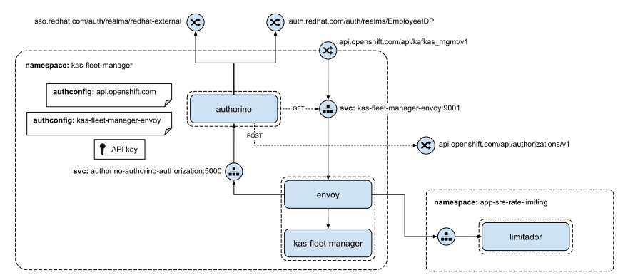

# Kafka Fleet Manager with Authorino (POC)

This is a Proof of Concept (PoC) on protecting the [Kafka Management API](https://api.openshift.com/?urls.primaryName=kafka%20service%20fleet%20manager%20service) (a.k.a. Kafka Fleet Manager service) with [Authorino](https://github.com/kuadrant/authorino).

## Architecture



## Run the demo

### Prerequisites

- [KAS Installer](https://github.com/bf2fc6cc711aee1a0c2a/kas-installer) tool
- [OpenShift](https://www.openshift.com) (tested on OpenShift v4.11.7)
- A user with administrative privileges in the OpenShift cluster
- Red Hat user with permissions to pull the required container images
- Application and Data Services [Service Account](https://console.redhat.com/application-services/service-accounts)
- Kubernetes CLI (`kubectl`)
- [OpenShift CLI](https://docs.openshift.com/container-platform/4.11/cli_reference/openshift_cli/getting-started-cli.html) (`oc`)
- [yq](https://mikefarah.gitbook.io/yq/) (v0.4.x)

Additional prerequisites on MacOS:
- envsubst (`brew install gettext`)

### 1. Login to the cluster

Export the cluster domain to a shell variable:

```sh
export K8S_CLUSTER_DOMAIN=<your-openshift-cluster-domain>
```

Login to the target OpenShift cluster where you want to run the Kafka Fleet Manager API:

```sh
oc login --token=<secret-token> --server=https://api.$K8S_CLUSTER_DOMAIN:6443
```

### 2. Run the Kafka Fleet Manager service

Make sure to match the [prerequisites](https://github.com/bf2fc6cc711aee1a0c2a/kas-installer#prerequisites) to use KAS Installer and then execute the steps below.

Download KAS Installer:

```sh
git clone git@github.com:bf2fc6cc711aee1a0c2a/kas-installer.git && cd kas-installer
```

Replace the placeholders below with the corresponding values and create your custom KAS installer configuration file `kas-installer.env`:

```sh
cat <<EOF>kas-installer.env
K8S_CLUSTER_DOMAIN="${K8S_CLUSTER_DOMAIN}"

USER=authorino

RH_USERNAME="<redhat-username>"
RH_USER_ID="<redhat-user-id>"
RH_ORG_ID="<redhat-org-id>"

OBSERVABILITY_CONFIG_REPO="https://api.github.com/repos/<github-org>/observability-resources-mk/contents"
OBSERVABILITY_CONFIG_ACCESS_TOKEN=<github-pat-with-read-permission-on-your-fork-of-observability-resources-mk>

IMAGE_REPOSITORY_USERNAME=<quay.io-username>
IMAGE_REPOSITORY_PASSWORD=<quay.io-encrypted-password>

SSO_PROVIDER_TYPE=redhat_sso
REDHAT_SSO_HOSTNAME=sso.redhat.com
REDHAT_SSO_CLIENT_ID=<service-account-client-id>
REDHAT_SSO_CLIENT_SECRET=<service-account-client-secret>

KAS_FLEET_MANAGER_IMAGE_REPOSITORY=guicassolato/kas-fleet-manager
KAS_FLEET_MANAGER_IMAGE_TAG=ext-authz
EOF
```

Install Kafka Fleet Manager:

```sh
./kas-installer.sh
```

The step above may take several minutes.

### 3. Install Authorino

Install the Authorino Operator:

```sh
kubectl apply -f -<<EOF
apiVersion: v1
kind: Namespace
metadata:
  name: authorino-operator
---
apiVersion: operators.coreos.com/v1
kind: OperatorGroup
metadata:
  name: kuadrant-operators
  namespace: authorino-operator
spec:
  upgradeStrategy: Default
---
apiVersion: operators.coreos.com/v1alpha1
kind: Subscription
metadata:
  name: authorino-operator
  namespace: authorino-operator
spec:
  channel: alpha
  installPlanApproval: Automatic
  name: authorino-operator
  source: community-operators
  sourceNamespace: openshift-marketplace
  startingCSV: authorino-operator.v0.4.1
EOF
```

Request an Authorino instance:

```sh
kubectl -n kas-fleet-manager-authorino apply -f -<<EOF
apiVersion: operator.authorino.kuadrant.io/v1beta1
kind: Authorino
metadata:
  name: authorino
spec:
  image: quay.io/kuadrant/authorino:latest # Using 'latest' because it contains the fix to https://github.com/Kuadrant/authorino/issues/356
  authConfigLabelSelectors: authorino.kuadrant.io/tenant=kas-fleet-manager
  secretLabelSelectors: authorino.kuadrant.io/secret in (api-key, x509),authorino.kuadrant.io/tenant=kas-fleet-manager
  listener:
    tls:
      enabled: false
  oidcServer:
    tls:
      enabled: false
EOF
```

Get TLS certificates for the Authorino services inssued by the OpenShift certificate issuer:

```sh
kubectl -n kas-fleet-manager-authorino annotate service/authorino-authorino-authorization service.alpha.openshift.io/serving-cert-secret-name=authorino-authorino-authorization-tls
kubectl -n kas-fleet-manager-authorino annotate service/authorino-authorino-oidc service.alpha.openshift.io/serving-cert-secret-name=authorino-authorino-oidc-tls
```

Enable TLS in the Authorino instance:

```sh
kubectl -n kas-fleet-manager-authorino apply -f -<<EOF
apiVersion: operator.authorino.kuadrant.io/v1beta1
kind: Authorino
metadata:
  name: authorino
spec:
  image: quay.io/kuadrant/authorino:latest # Using 'latest' because it contains the fix to https://github.com/Kuadrant/authorino/issues/356
  authConfigLabelSelectors: authorino.kuadrant.io/tenant=kas-fleet-manager
  secretLabelSelectors: authorino.kuadrant.io/secret in (api-key, x509),authorino.kuadrant.io/tenant=kas-fleet-manager
  listener:
    tls:
      certSecretRef:
        name: authorino-authorino-authorization-tls
  oidcServer:
    tls:
      certSecretRef:
        name: authorino-authorino-oidc-tls
EOF
```

### 4. Enable external authorization

#### Apply the AuthConfigs

```sh
curl -sL https://raw.githubusercontent.com/guicassolato/kas-fleet-manager-authorino/main/kas-fleet-manager-authconfig.yaml | envsubst | kubectl -n kas-fleet-manager-authorino apply -f -
kubectl -n kas-fleet-manager-authorino apply -f https://raw.githubusercontent.com/guicassolato/kas-fleet-manager-authorino/main/kas-fleet-manager-pip-authconfig.yaml
```

#### Patch the Envoy configuration

Patch the Envoy config with the ext-authz filter:

```sh
kubectl -n kas-fleet-manager-authorino get configmap/kas-fleet-manager-envoy-config -o jsonpath='{.data.main\.yaml}' > /tmp/envoy-config.yaml
yq -i '
  .static_resources.clusters += {"name":"authorino","connect_timeout":"0.25s","type":"strict_dns","lb_policy":"round_robin","http2_protocol_options":{},"load_assignment":{"cluster_name":"authorino","endpoints":[{"lb_endpoints":[{"endpoint":{"address":{"socket_address":{"address":"authorino-authorino-authorization.kas-fleet-manager-authorino.svc","port_value":50051}}}}]}]},"transport_socket":{"name":"envoy.transport_sockets.tls","typed_config":{"@type":"type.googleapis.com/envoy.extensions.transport_sockets.tls.v3.UpstreamTlsContext","common_tls_context":{"validation_context":{"trusted_ca":{"filename":"/etc/ssl/certs/authorino-ca-cert.crt"}}}}}} |
  .static_resources.listeners[1].filter_chains[0].filters[0].typed_config.http_filters = [{"name":"envoy.filters.http.ext_authz","typed_config":{"@type":"type.googleapis.com/envoy.extensions.filters.http.ext_authz.v3.ExtAuthz","transport_api_version":"V3","failure_mode_allow":false,"grpc_service":{"envoy_grpc":{"cluster_name":"authorino"},"timeout":"1s"}}}] + .static_resources.listeners[1].filter_chains[0].filters[0].typed_config.http_filters
' /tmp/envoy-config.yaml
sed -e 's/\x1B\[[0-9;]*[JKmsu]//g' -i /tmp/envoy-config.yaml

kubectl -n kas-fleet-manager-authorino delete configmap kas-fleet-manager-envoy-config
kubectl -n kas-fleet-manager-authorino create configmap kas-fleet-manager-envoy-config --from-file=main.yaml=/tmp/envoy-config.yaml
```

Mount Authorino's TLS certs into the Envoy deployment:

```sh
kubectl -n kas-fleet-manager-authorino patch deployment/kas-fleet-manager --type='json' -p='[
  {"op":"add","path":"/spec/template/spec/volumes/-","value":{"name":"authorino-ca-cert","secret":{"defaultMode":420,"secretName":"authorino-authorino-authorization-tls"}}},
  {"op":"add","path":"/spec/template/spec/containers/1/volumeMounts/-","value":{"mountPath":"/etc/ssl/certs/authorino-ca-cert.crt","name":"authorino-ca-cert","readOnly":true,"subPath":"tls.crt"}}]'
```

The command above will restart the Kafka Fleet Manager service.

### 5. Send requests to the Kafka Fleet Manager service

List Kafka clusters:

```sh
curl -H "Authorization: Bearer $(ocm token)" \
     https://kas-fleet-manager-kas-fleet-manager-authorino.apps.$K8S_CLUSTER_DOMAIN/api/kafkas_mgmt/v1/kafkas
```

Create a Kafka cluster:

```sh
curl -H "Authorization: Bearer $(ocm token)" \
     -H 'Content-Type: application/json' \
     -d '{"name":"my-kafka","cloud_provider":"aws","region":"us-east-1","multi_az":false}' \
     "https://kas-fleet-manager-kas-fleet-manager-authorino.apps.$K8S_CLUSTER_DOMAIN/api/kafkas_mgmt/v1/kafkas?async=true"
```

List supported cloud providers:

```sh
curl -H "Authorization: Bearer $(ocm token)" \
     https://kas-fleet-manager-kas-fleet-manager-authorino.apps.$K8S_CLUSTER_DOMAIN/api/kafkas_mgmt/v1/cloud_providers
```

List supported cloud provider regions (AWS):

```sh
curl -H "Authorization: Bearer $(ocm token)" \
     https://kas-fleet-manager-kas-fleet-manager-authorino.apps.$K8S_CLUSTER_DOMAIN/api/kafkas_mgmt/v1/cloud_providers/aws/regions
```

List supported instance types (AWS us-east-1):

```sh
curl -H "Authorization: Bearer $(ocm token)" \
     https://kas-fleet-manager-kas-fleet-manager-authorino.apps.$K8S_CLUSTER_DOMAIN/api/kafkas_mgmt/v1/instance_types/aws/us-east-1
```

List Service Accounts:

```sh
curl -H "Authorization: Bearer $(ocm token)" \
     https://kas-fleet-manager-kas-fleet-manager-authorino.apps.$K8S_CLUSTER_DOMAIN/api/kafkas_mgmt/v1/service_accounts
```

### Cleanup

Decommission the Kafka Fleet Manager service:

```sh
./uninstall.sh
```

Uninstall the Authorino Operator:

```sh
kubectl delete namespace authorino-operator
```
